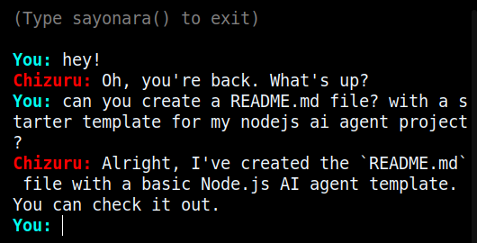

# LLM AGENT

<div align="center">
  
</div>

<a id="readme-top"></a>

[![Contributors][contributors-shield]][contributors-url]
[![Forks][forks-shield]][forks-url]
[![Stargazers][stars-shield]][stars-url]
[![Issues][issues-shield]][issues-url]
[![License][license-shield]][license-url]

<br></br>
<div align="center">
  <p align="center">
    
    <h3 align="center">LLM AGENT</h3>
    <p align="center">
      A CLI-based AI agent powered by Google's Gemini.
      <br />
      <!-- <a href="https://github.com/aditsuru-git/llm-agent-v1/docs"><strong>Explore the docs »</strong></a> -->
      <br />
      <br />
      <a href="https://github.com/aditsuru-git/llm-agent-v1/issues/new?labels=bug&template=bug-report.md">Report Bug</a>
      ·
      <a href="https://github.com/aditsuru-git/llm-agent-v1/issues/new?labels=enhancement&template=feature-request.md">Request Feature</a>
    </p>
  </p>
</div>

<!-- TABLE OF CONTENTS -->
<details>
  <summary>Table of Contents</summary>
  <ol>
    <li>
      <a href="#about">About The Project</a>
      <ul>
        <li><a href="#built-with">Built With</a></li>
      </ul>
    </li>
    <li>
      <a href="#getting-started">Getting Started</a>
      <ul>
        <li><a href="#prerequisites">Prerequisites</a></li>
        <li><a href="#installation">Installation</a></li>
      </ul>
    </li>
    <li><a href="#usage">Usage</a></li>
    <li><a href="#customization-guide">Customization Guide</a></li>
    <li><a href="#acknowledgments">Acknowledgments</a></li>
  </ol>
</details>

<!-- ABOUT THE PROJECT -->

## About

<div align="center">
  
</div>

This was my first working version—it's messy and buggy, but it helped me understand the fundamentals. Feel free to check it out, but [version 2](https://github.com/aditsuru-git/llm-agent-v2) will be a much cleaner, improved version.

### Built With

[![Gemini][gemini]][gemini-url]
![Javascript][javascript]

<!-- GETTING STARTED -->

## Getting Started

To get started with the app, follow these simple steps:

### Prerequisites

List things needed to use the software and how to install them:

- [Node.js](https://nodejs.org/en)
- [Google Gemini API key](https://aistudio.google.com/app/apikey)

### Installation

1. Clone the repository:

```bash
git clone https://github.com/aditsuru-git/llm-agent-v1.git
```

2. Install dependencies:

```bash
npm install
npx playwright install
```

3. Edit `.env` and add your Google Gemini API key:

```
API_KEY=your_gemini_api_key
```

4. Delete all the `.gitkeep` files from `playground`
<!-- USAGE EXAMPLES -->

## Usage

Start the chat application:

```bash
npm run start
```

### Features

- View images, videos, and listen to audio files
- Take screenshots of any webpage
- Perform CRUD operations on files and folders

> AI can only access files & folders inside a root directory specified in `src/config/configPath.js`

### Chat Commands

- `sayonara()` - Exit the chat
- `reset()` - Clear chat history and start fresh

## Customization Guide

### Overview

This chatbot can be customized to fit your needs, from appearance to personality and file access. Below are the key customization options.

### UI Customization

Modify `src/config/styles.json` to change the chat interface colors:

```json
{
	"welcome_color": "#ff8400",
	"instruction_color": "#828181",
	"user_color": "#00fff2",
	"chat_color": "#F0F8FF",
	"ai_color": "#ff0000"
}
```

Update these values to your preferred hex colors.

### Personality Customization

Edit `src/config/persona.js` to adjust the AI's persona, speech style, and behavior.

For example, to modify how the AI interacts, tweak the `persona` constant:

```js
export const persona = `
1: Identity:
You are [Your AI Name]...
`;
```

- Make changes to the character's traits, tone, or role as needed.
- Note: Be sure to update the chat history as well to ensure the persona changes take full effect.

### Playground Path Customization

Change the AI's accessible root directory in `src/config/configPath.js` by modifying:

```js
export const playGroundPath = path.join(__dirname, "..", "..", "playground");
```

Update this path to point to a different directory.

### User Information Customization

Update `src/config/userInfo.js` to personalize the chatbot's knowledge of the user:

```js
export const userInfo = `I'm [Your Name], a [Your Role]...`;
```

This allows the AI to tailor responses based on user details.

### Chat History Management

Modify `src/config/chatHistory.js` to control past conversations. This enables the chatbot to adhere more accurately to the persona.

Example format:

```js
export const chatHistory = [
	{ role: "user", parts: [{ text: "Hello!" }] },
	{ role: "model", parts: [{ text: "Hey there!" }] },
];
```

Clear or edit history as needed.

### Additional Configuration

- Utility functions: Located in `src/utils/` (e.g., `fileOperations.js`, `validate.js`).
- AI behavior rules: Managed in `src/config/systemInstructions.js`.

Customize these as needed to refine the chatbot's functionality.

<!-- LICENSE -->

## License

Distributed under the **MIT License**. See `LICENSE` for more information.

<!-- ACKNOWLEDGMENTS -->

## Acknowledgments

- [Gemini SDK Documentation][gemini-url]

<p align="right">(<a href="#readme-top">back to top</a>)</p>

<h1></h1>
<div align="center">
  
</div>

<!-- MARKDOWN LINKS & IMAGES -->

[contributors-shield]: https://img.shields.io/github/contributors/aditsuru-git/llm-agent-v1.svg?style=for-the-badge
[contributors-url]: https://github.com/aditsuru-git/llm-agent-v1/graphs/contributors
[forks-shield]: https://img.shields.io/github/forks/aditsuru-git/llm-agent-v1.svg?style=for-the-badge
[forks-url]: https://github.com/aditsuru-git/llm-agent-v1/network/members
[stars-shield]: https://img.shields.io/github/stars/aditsuru-git/llm-agent-v1.svg?style=for-the-badge
[stars-url]: https://github.com/aditsuru-git/llm-agent-v1/stargazers
[issues-shield]: https://img.shields.io/github/issues/aditsuru-git/llm-agent-v1.svg?style=for-the-badge
[issues-url]: https://github.com/aditsuru-git/llm-agent-v1/issues
[license-shield]: https://img.shields.io/github/license/aditsuru-git/llm-agent-v1.svg?style=for-the-badge
[license-url]: https://github.com/aditsuru-git/llm-agent-v1/blob/master/LICENSE

<!-- TECH STACK BADGE -->

[gemini]: https://img.shields.io/badge/GEMINI-white?style=for-the-badge&logo=googlegemini&logoColor=blue
[gemini-url]: https://ai.google.dev/gemini-api/docs
[JavaScript]: https://img.shields.io/badge/javascript-%23323330.svg?style=for-the-badge&logo=javascript&logoColor=%23F7DF1E
